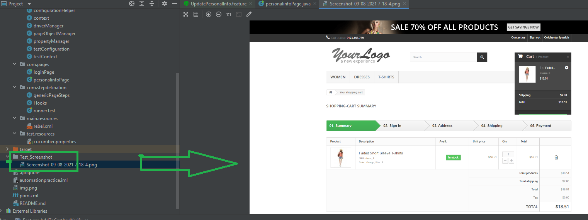
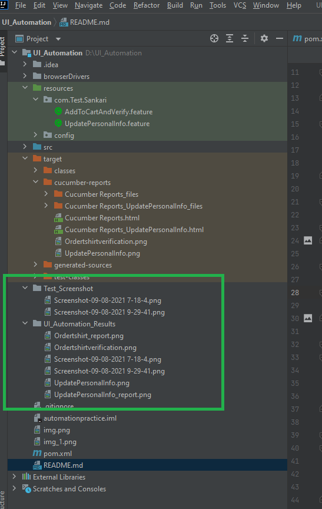

# To Get Started

## Pre-requisites

- Install JDK and Maven and set environment path
- Chrome or Firefox browsers installed
- Text Editor(Optional) installed-->Sublime/Visual Studio Code/IntelliJ IDEA Ultimate

## Setup Scripts

- Clone the repository into a folder
- Go inside the folder and run following command from terminal/command prompt
- this should install all the dependencies from pom.xml(Need to have Admin rights)

## How to run Cucumber Test

Cucumber

Right click on .feature file, and Run -> This will run .feature file on default settings

## Screenshot Captured

Screenshot captured at below path

## Reports

- Cucumber results are available in UI_Automation_Results 

  

## Highlights
- Page Object model implementation./n
- Handling Sync
- Multibrowser support
- BDD with cucumber
- Cucumber report
- Screenshot generated through code

## Future Improvements
- Can be integrated to CI CD pipeline
- Headless browser options can be included to run the scripts
- Can be containerised to  docker containers for easy portability
- Secured  credential management can be added to integrate
- More reusable methods can be written for common functionalities
